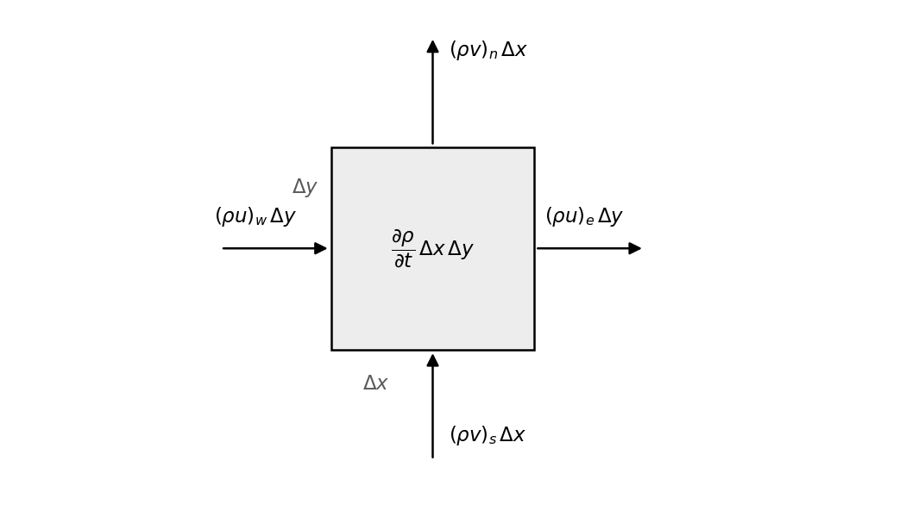
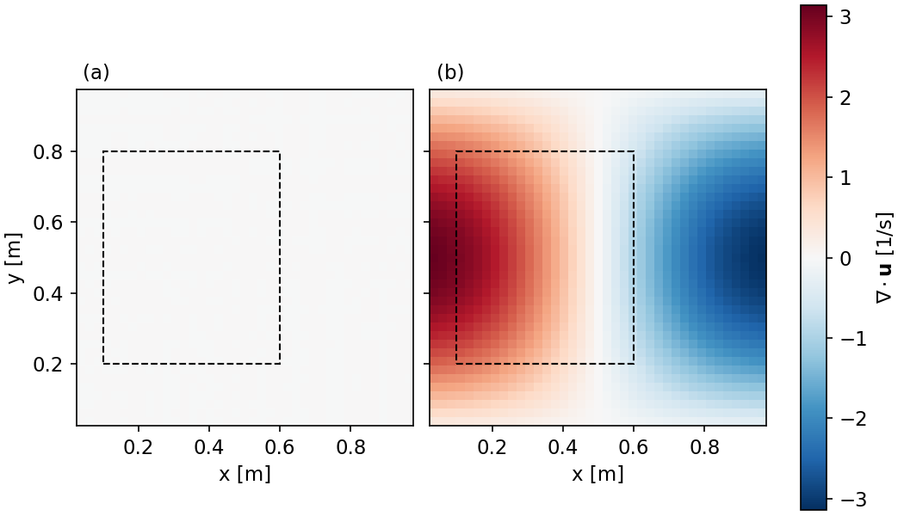
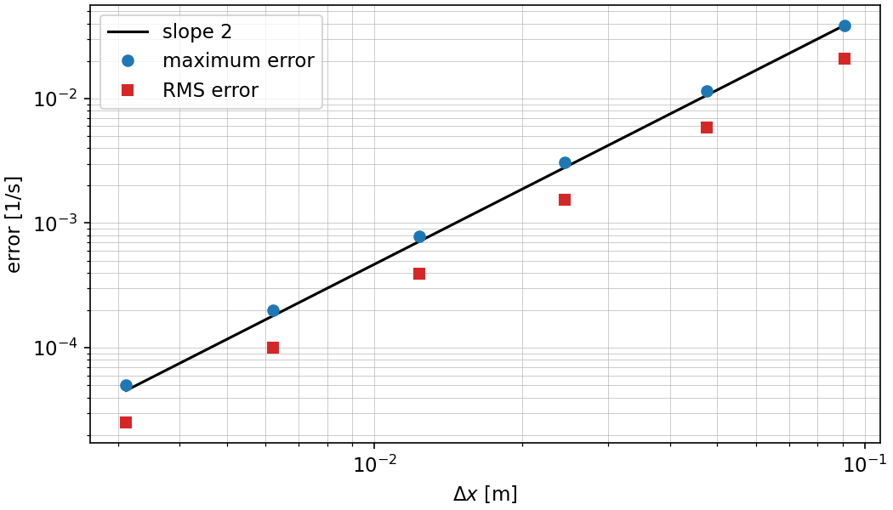

# F01 · Conservation of mass


## The case

Draw a fixed rectangle in a moving fluid. The rectangle has sides $\Delta x$ [m] and $\Delta y$ [m], and unit depth in the third direction. Fluid crosses its four faces, carrying mass in and out.

Mass is neither created nor destroyed inside the rectangle. The mass held inside it therefore changes only through the four faces. Figure 1 names those four mass flows, each written as a density times a velocity times a face length.



*Figure 1. A fixed rectangle of size $\Delta x$ by $\Delta y$. The four arrows are the mass flow through each face [kg/s]. The subscripts $w$, $e$, $s$ and $n$ mark the west, east, south and north face.*

This post turns that statement into an equation, and asks what the equation requires of the velocity field $u$, $v$ [m/s] and the density $\rho$ [kg/m³].

## The physics

### Integral form

The mass inside a fixed volume $V$ is $\int_V \rho \, \mathrm{d}V$. The mass leaving $V$ per unit time through its surface $S$ is $\oint_S \rho\, \mathbf{u}\cdot\mathbf{n}\,\mathrm{d}S$, where $\mathbf{n}$ is the outward unit normal. The rate of change of the first equals minus the second:

$$\frac{\mathrm{d}}{\mathrm{d}t}\int_V \rho \, \mathrm{d}V + \oint_S \rho\, \mathbf{u}\cdot\mathbf{n}\,\mathrm{d}S = 0 \tag{1}$$

Both terms of (1) have the unit kg/s.

Applied to the rectangle of Figure 1, with $\rho\mathbf{u}$ taken as uniform along each face, equation (1) reads

$$\frac{\partial \rho}{\partial t}\,\Delta x\,\Delta y + \left[(\rho u)_e - (\rho u)_w\right]\Delta y + \left[(\rho v)_n - (\rho v)_s\right]\Delta x = 0 \tag{2}$$

Equation (2) is the form a finite volume solver works with. Post F05 returns to it.

### Differential form

The volume $V$ is fixed, so the time derivative in (1) moves inside the integral. The divergence theorem turns the surface integral into a volume integral:

$$\int_V \left[\frac{\partial \rho}{\partial t} + \nabla\!\cdot\!(\rho\mathbf{u})\right]\mathrm{d}V = 0 \tag{3}$$

Equation (3) holds for every volume $V$ inside the fluid. A continuous integrand whose integral vanishes over every volume is zero at every point, which gives the continuity equation:

$$\frac{\partial \rho}{\partial t} + \nabla\!\cdot\!(\rho\mathbf{u}) = 0 \tag{4}$$

Each term of (4) has the unit kg/(m³·s). Written out in two dimensions:

$$\frac{\partial \rho}{\partial t} + \frac{\partial (\rho u)}{\partial x} + \frac{\partial (\rho v)}{\partial y} = 0 \tag{5}$$

### Constant density

Expanding the product in (4) gives

$$\frac{\partial \rho}{\partial t} + \mathbf{u}\cdot\nabla\rho + \rho\,\nabla\!\cdot\!\mathbf{u} = 0 \tag{6}$$

Assume the density is constant in time and in space. This assumption removes the first term of (6), because $\partial\rho/\partial t = 0$, and the second term, because $\nabla\rho = \mathbf{0}$. What remains is $\rho\,\nabla\!\cdot\!\mathbf{u} = 0$, and $\rho > 0$, so

$$\nabla\!\cdot\!\mathbf{u} = 0 \tag{7}$$

In two dimensions,

$$\frac{\partial u}{\partial x} + \frac{\partial v}{\partial y} = 0 \tag{8}$$

Each term of (8) has the unit 1/s. A velocity field that satisfies (8) is called divergence-free.

Equation (8) holds no time derivative and no pressure. It does not advance any variable from one time level to the next; it is a condition the velocity field must meet at every instant. That difference is the reason incompressible flow needs the methods of branch C, where the pressure is found by requiring (8) rather than by a transport equation of its own.

A closed-form solution is not derived here, because (8) is a constraint rather than a case to solve. In place of an exact solution, the check in this post uses two velocity fields whose divergence is known by hand.

## How to solve it

The square domain $0 \le x \le L$, $0 \le y \le L$ with $L = 1$ m is covered by a cell-centred grid of $N$ cells per direction. Cell $i$ has its centre at

$$x_i = \left(i + \tfrac{1}{2}\right)\Delta x, \qquad \Delta x = \frac{L}{N} \tag{9}$$

and the same in $y$, so no node sits on the boundary. Arrays are indexed `[j, i]`, where row `j` holds the $y$ position and column `i` holds the $x$ position.

Each derivative in (8) is replaced by a central difference,

$$\left(\frac{\partial u}{\partial x}\right)_{i,j} \approx \frac{u_{i+1,j} - u_{i-1,j}}{2\Delta x} \tag{10}$$

A Taylor expansion of $u_{i+1,j}$ and $u_{i-1,j}$ about $x_i$ leaves a leading error term $-(\Delta x^2/6)\,\partial^3 u/\partial x^3$, so (10) is second-order accurate. The same form and the same order apply to $\partial v/\partial y$. The discrete divergence at one interior node is

$$D_{i,j} = \frac{u_{i+1,j} - u_{i-1,j}}{2\Delta x} + \frac{v_{i,j+1} - v_{i,j-1}}{2\Delta y} \tag{11}$$

Equation (11) needs a neighbour on both sides of the node, so it is applied on interior nodes only. The boundary nodes are left empty.

Two velocity fields are used. Field A is the Taylor-Green field (Taylor and Green, 1937),

$$u = U_0 \sin\frac{\pi x}{L}\cos\frac{\pi y}{L}, \qquad v = -U_0 \cos\frac{\pi x}{L}\sin\frac{\pi y}{L} \tag{12}$$

with $U_0 = 1$ m/s. Differentiating (12) gives $\partial u/\partial x = +(\pi U_0/L)\cos(\pi x/L)\cos(\pi y/L)$ and $\partial v/\partial y$ equal to the same expression with a minus sign, so

$$\nabla\!\cdot\!\mathbf{u} = 0 \quad \text{everywhere for field A} \tag{13}$$

On the unit square, field A is one vortex cell with its centre of rotation at $x = y = L/2$. The cover figure shows it.

Field B has a single velocity component,

$$u = U_0 \sin\frac{\pi x}{L}\sin\frac{\pi y}{L}, \qquad v = 0 \tag{14}$$

and a divergence that is known in closed form and is not zero:

$$\nabla\!\cdot\!\mathbf{u} = \frac{\pi U_0}{L}\cos\frac{\pi x}{L}\sin\frac{\pi y}{L} \tag{15}$$

Field B does not conserve mass. It is used because (15) can be subtracted from (11) to give an error at every node, which is what the grid study of this post measures.


*Figure 2. The two velocity fields on a 21 × 21 grid. (a) Field A, equation (12). (b) Field B, equation (14), which has no $v$ component.*

## Excel solver

This post has no spreadsheet. There is no case to solve here, only an identity to check on a grid, and the check needs several grids in sequence. The first spreadsheet of the series is in post F04.

## Python solver

File: `F01-conservation-of-mass.ipynb`

**Step 1. Inputs.** The side $L$, the cell count $N$, the velocity scale $U_0$ and the density $\rho$ are set here, together with the list of grids for Step 6 and the corners of the control volume for Step 5.

**Step 2. Grid.** One function returns the cell centres and $\Delta x$ from equation (9):

```python
dx = L / n
x = (np.arange(n) + 0.5) * dx
X, Y = np.meshgrid(x, x)
```

**Step 3. Velocity fields.** Equations (12), (14) and (15), one function each.

**Step 4. Discrete divergence.** Equation (11) on the interior nodes, written with array slices:

```python
d[1:-1, 1:-1] = ((u[1:-1, 2:] - u[1:-1, :-2]) / (2 * dx)
                 + (v[2:, 1:-1] - v[:-2, 1:-1]) / (2 * dx))
```

**Step 5. Mass balance over a control volume.** The net mass flow out through the four faces of a box is compared with the integral of $\rho\,\nabla\!\cdot\!\mathbf{u}$ over the same box. Both sides use the trapezoid rule over the same rectangle, so the difference between them measures the error of (11) alone. The box is placed off centre, because a box centred on the domain gives zero on both sides for either field by symmetry.

**Step 6. Grid refinement.** For field B, the error $D_{i,j} - (\nabla\!\cdot\!\mathbf{u})_{i,j}$ is formed on each grid, and its maximum and root-mean-square value over the interior nodes are recorded. Both measures are defined again in post F04.

**Step 7. Plots.** The five figures of this post.

## Results

All results below are from the cell-centred grid of equation (9) with the central difference of (11). Nothing in this post is marched in time or iterated, so there is no time step and no convergence criterion to report.

**Field A.** On the grid $N = 41$, $\Delta x = 0.02439$ m, the largest discrete divergence anywhere in the interior is $1.13\times10^{-14}$ s⁻¹, which is the level of double-precision round-off. The reason is algebraic rather than numerical. Substituting (12) into (11) and using $\sin(a+b)-\sin(a-b) = 2\cos a \sin b$, the two central differences give

$$\frac{\partial u}{\partial x}\bigg|_{\text{discrete}} = \frac{U_0}{\Delta x}\cos\frac{\pi x}{L}\cos\frac{\pi y}{L}\sin\frac{\pi \Delta x}{L} \tag{16}$$

and $\partial v/\partial y$ discrete gives the same expression with a minus sign. The two cancel term by term at every node, on any uniform grid, for any $\Delta x$. Field A is divergence-free in the discrete sense as well as in the exact sense.

**Field B.** On the same grid the largest discrete divergence is 3.118 s⁻¹, against a largest exact value of 3.139 s⁻¹ from (15) sampled at the same nodes.



*Figure 3. Discrete divergence from equation (11) on the grid $N = 41$, both panels on the same colour scale. (a) Field A. (b) Field B. The dashed line is the control volume of Step 5.*

**Mass balance.** The control volume is asked for as $0.10 \le x \le 0.60$ m, $0.20 \le y \le 0.80$ m. Its faces move to the nearest grid line, which gives the box $0.1098 \le x \le 0.5976$ m, $0.2073 \le y \le 0.7927$ m on the grid $N = 41$. The values are per unit depth, so the unit is kg/(m·s).

| Field | Surface integral [kg/(m·s)] | Volume integral [kg/(m·s)] | Difference [kg/(m·s)] |
|---|---|---|---|
| A | $5.55\times10^{-17}$ | $1.54\times10^{-17}$ | $4.01\times10^{-17}$ |
| B | $3.1141\times10^{-1}$ | $3.1096\times10^{-1}$ | $4.57\times10^{-4}$ |

For field A both integrals are at round-off level: no mass accumulates in the box. For field B the two sides agree to a relative difference of $1.47\times10^{-3}$, which is the error of the second-order central difference at $\Delta x = 0.02439$ m. Refining to $N = 81$ and $N = 161$ reduces that relative difference to $3.76\times10^{-4}$ and $9.52\times10^{-5}$, a factor of about four for each halving of $\Delta x$.

**Grid study.** The error of (11) against the exact value (15) is measured on six grids. The maximum error is the largest absolute error over the interior nodes, and the RMS error is the root mean square of the same set. The observed order between two successive grids is $p = \ln(e_1/e_2)\,/\,\ln(\Delta x_1/\Delta x_2)$.

| $N$ | $\Delta x$ [m] | Maximum error [1/s] | RMS error [1/s] | $p$ from maximum | $p$ from RMS |
|---|---|---|---|---|---|
| 11 | 0.09091 | $3.869\times10^{-2}$ | $2.078\times10^{-2}$ | – | – |
| 21 | 0.04762 | $1.141\times10^{-2}$ | $5.821\times10^{-3}$ | 1.888 | 1.968 |
| 41 | 0.02439 | $3.053\times10^{-3}$ | $1.535\times10^{-3}$ | 1.971 | 1.993 |
| 81 | 0.01235 | $7.863\times10^{-4}$ | $3.937\times10^{-4}$ | 1.992 | 1.998 |
| 161 | 0.006211 | $1.993\times10^{-4}$ | $9.967\times10^{-5}$ | 1.998 | 2.000 |
| 321 | 0.003115 | $5.015\times10^{-5}$ | $2.508\times10^{-5}$ | 2.000 | 2.000 |

The observed order approaches 2.000 from below, which matches the order predicted for (10) by the Taylor expansion.



*Figure 4. Error of the discrete divergence of field B against $\Delta x$, on logarithmic axes. The solid black line has slope 2.*

## Files

| File | Content |
|---|---|
| `F01-conservation-of-mass.ipynb` | Python notebook |
| `figures/` | All figures in this post |

## References

Taylor, G. I. and Green, A. E. (1937). Mechanism of the production of small eddies from large ones. Proceedings of the Royal Society A, 158, 499–521.

Batchelor, G. K. (2000). An Introduction to Fluid Dynamics. Cambridge University Press, pages 71–75.

Ferziger, J. H., Perić, M. and Street, R. L. (2020). Computational Methods for Fluid Dynamics, 4th edition. Springer, pages 5–7.
